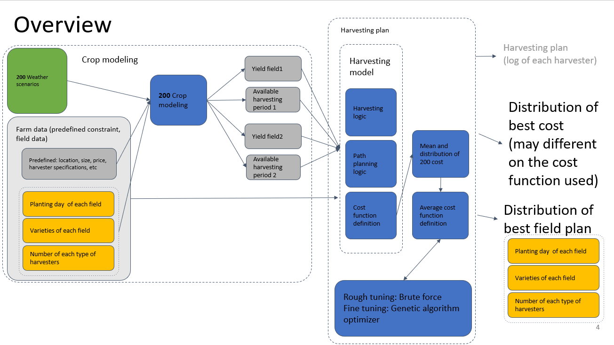
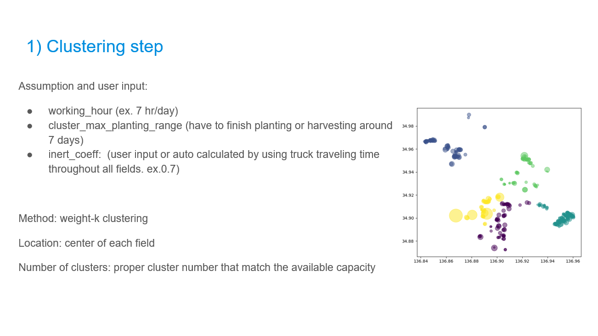
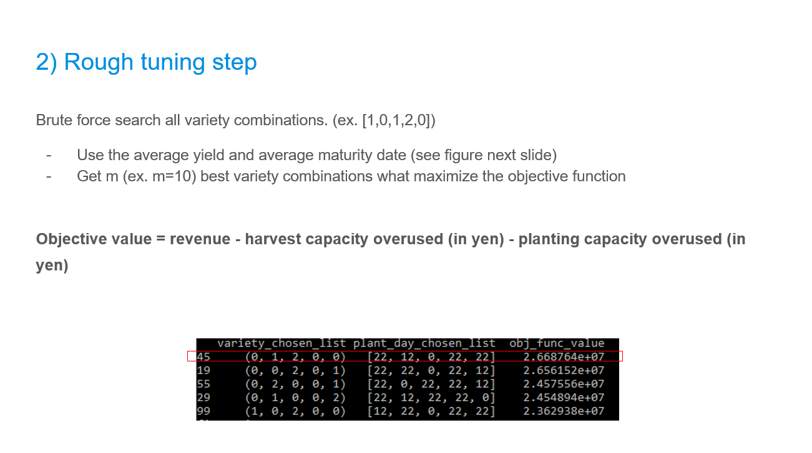
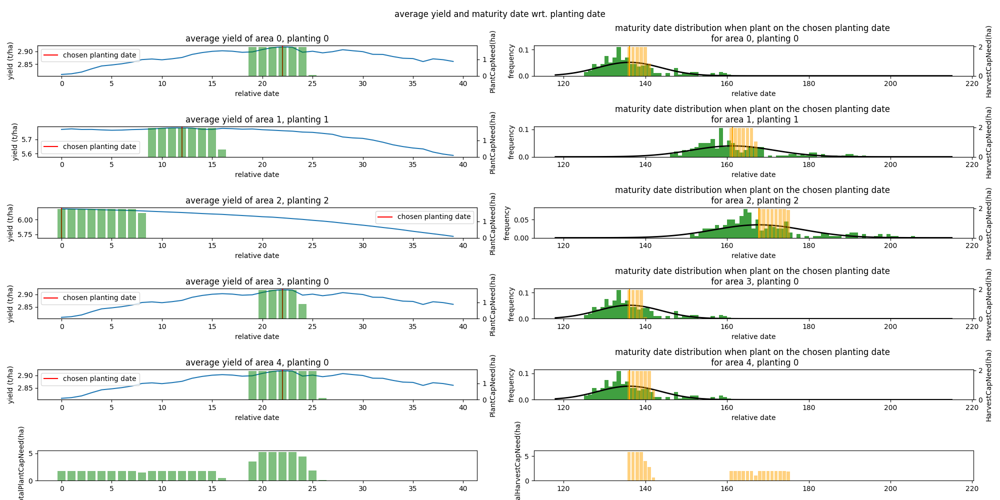
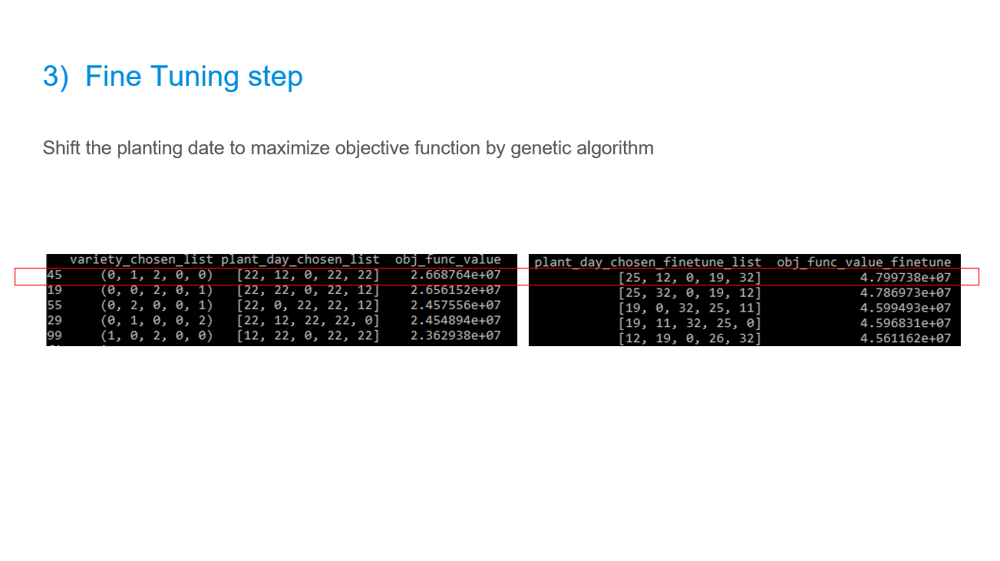
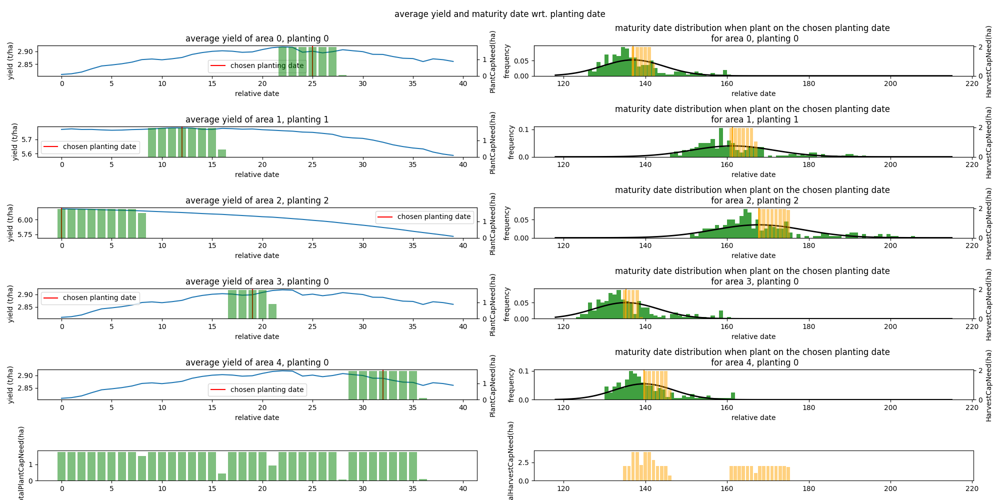
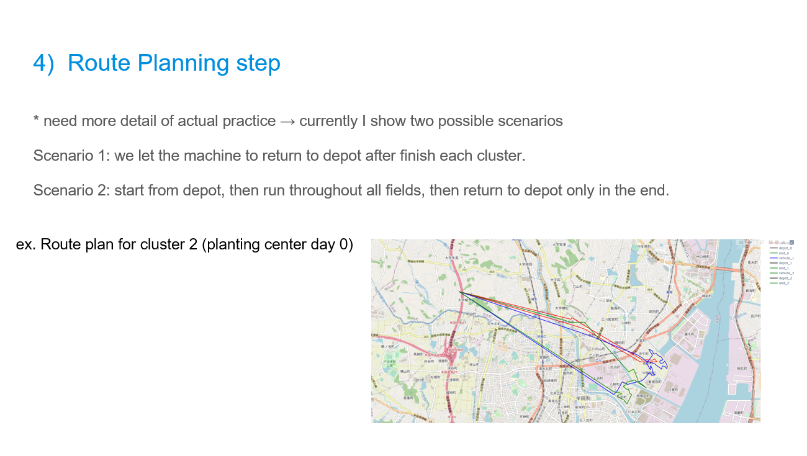

Field mangement project based one geospatial data, physical constraints and other modeling result, for the consideration of best planting plan and route planning for several fields

# Objective
This project 
- To obtain “optimal planting plan and resource used”, that would provide acceptable profits
    - To get the planting variety, and planting dates of each field (and estimated harvesting dates as the by product)
    - To get the planting and harvesting routing for multiple machines.
- To make the field optimization algorithm feasible for several hundreds fields.

### step 0) create offline cropsim simulation result
- generate cropsim for 200 weather scenarios for each variety in the interested planting date range

### step 1) clustering: 
- get the proper number of cluster and group fields together

### step 2) roughtuning: 
- bruteforce gridsearch the best n combinations of varieties for each field

### step 3) finetuning: 
- shift the planting date for all best n combinations from previous step. Use GA for relative day for planting day shift from the default one

### step 4) route planning: 
- use or-tools (free library from google for route optimization) for route planning.

# organization of the repository

## farm_def folder
- defined farm polygon in .geojson
- defined machine definition in .json

## program folder
- python programs that do the calculation of each step. This includes

    - utils: all utility functions used in other python files
    - field_clustering.py: all programs used for field clustering step
    - rough_tuning.py: all program files for rough tuning step
    - fine_tuning.py: all program files for fine tuning step
    - route_planning.py: all program files for route planning step

    - functions in field_clustering.py, rough_tuning.py, fine_tuning.py, route_planning.py are called in main.py

## result_* folder
- store results (json, or figure) in those steps.

## main.py
- main program that run all steps. Please look at this file firstly when start looking at this project.

# further improvement

1. The distance in route planning. Currently we are using straight lines between each points. We may use google map api to get actual traveling distance.
    - current distance definition is in distance_callback_index() in program/utils/utils_routing.py 
    

2. The condition of route planning need more actual practice data (such as truck information, how many truck, should one truck carry multiple machines, how they carry machine, how they store the harvested product (any capacity limited?), machine cleaning necessity, place to put machine at rest in the end of each day, ..etc)
